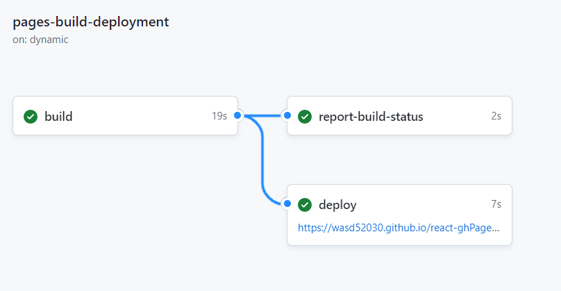

# react-ghPageTest
測試用react上github pages的玩意，來源是[這東西](https://github.com/wasd52030/WebCodes/tree/master/React/react-meetups)

## 大致步驟
**這邊使用yarn，要用npm、pnpm等等自行決定**

1. 在github創一個repo，並把本機的React Project丟上去
2. 在React Project中裝`gh-pages`
  ```
  yarn add gh-pages
  ```
3. 打開`package.json`，輸入
  ```
  "homepage"："https://Username.github.io/app-name"
  ```
  **Username 為你的 GitHub id。**
  **app-name 為你的 repo name。**
4. 繼續在`package.json`中，於`script`的地方加入
  ```
  "predeploy": "npm run build",
  "deploy": "gh-pages -d dist"
  ```
  <b><i>gh-pages -d dist</i>中的<i>dist</i>依據你build出來的靜態網頁資料夾決定</b>

5. 在terminal執行
  ```
  yarn deploy
  ```
  
  來進行deploy

6. 到你的github Repository的Actions頁面觀察deploy的進度，出現類似畫面代表成功

   可以到剛才在`package.json`中寫的`homepage`網址中試試
   
  
  
大致上就完工了

## note
route的部分記得加上該Repository的名稱作前綴

## reference
- https://jim1105.coderbridge.io/2022/08/21/react-github-page/
- https://rexhung0302.github.io/2021/09/28/20210928/
- https://www.jb51.net/article/273964.htm
